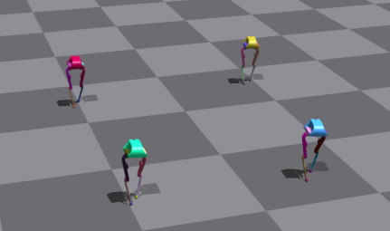

# bolt

This repository contains the training code for Bolt's journey of learning to walk.



Bolt is an open-source biped robot developed by [Open Dynamics Robot Initiave](https://open-dynamic-robot-initiative.github.io/). The properties and configurations for the robot, as well as its base URDF can be found [here](https://github.com/open-dynamic-robot-initiative/robot_properties_bolt).


## Installation

This repo comes prepacked with [IsaacGymEnvs](https://github.com/NVIDIA-Omniverse/IsaacGymEnvs). To setup your environment on a fresh server, follow these steps. 

1. Clone the repository:

   ```bash
   git clone https://github.com/rafacelente/bolt.git
   ```

2. Miniconda installation

    ```bash
    mkdir -p ~/miniconda3
    wget https://repo.anaconda.com/miniconda/Miniconda3-latest-Linux-x86_64.sh -O ~/miniconda3/miniconda.sh
    bash ~/miniconda3/miniconda.sh -b -u -p ~/miniconda3
    rm -rf ~/miniconda3/miniconda.sh
    ~/miniconda3/bin/conda init bash
    # To make changes take into effect, close the terminal and re-open it.
    ```

3. Environment creation
    ```bash
    conda create -n isaac python=3.8
    conda activate isaac
    conda install -y gxx_linux-64
    cd /path/to/bolt/isaacgym/python && pip install --user --no-cache-dir -e .
    cd /path/to/notebooks/bolt/IsaacGymEnvs && pip install --user --no-cache-dir  -e .
    pip install "numpy<1.24"

    # After each of these steps, do conda deactivate -> conda activate isaac
    conda env config vars set LD_LIBRARY_PATH=$LD_LIBRARY_PATH:$CONDA_PREFIX/lib --name $CONDA_DEFAULT_ENV
    conda env config vars set VK_ICD_FILENAMES=/usr/share/vulkan/icd.d/nvidia_icd.json --name $CONDA_DEFAULT_ENV
    ```

## Launching a training/simulation session

All training/simulation is done through the the script `./IsaacGymEnvs/isaacgymenvs/train.py`. The default configuration parameters can be found on `.IsaacGymEnvs/isaacgymenvs/cfg/config.yaml`. An example training job is:

```bash
python train.py python train.py task=Bolt wandb_activate=True headless=False num_envs=1024 headless=True max_iterations=1000
```

Some (not all) pertinent flags:
-  `test=True`: launches a simulation session (no training)
- `max_iterations=1000`: Sets the number of training epochs.
- `checkpoint=/path/to/model.pth`: Executes a training/simulation sessions starting from a given pre-trained model.
-  `num_envs=1024`: Number of vectorized environments in the training run.
- `wandb_activate=True`: activates Weights and Biases logging. Make sure you have `wandb` and [log in with your wandb account](https://docs.wandb.ai/ref/cli/wandb-login).

## Bolt configuration

### URDF and meshses

The URDF used for this project was slightly changed from the base URDF from ODRI. All URDF files can be found on `./IsaacGymEnvs/assets/urdf`, and meshes can also be found on `./IsaacGymEnvs/assets/meshes`. 

### Simulation and Environment

The environment, agent, and reward definitions can be found on `./IsaacGymEnvs/isaacgymenvs/tasks/bolt.py`. Its configuration file can be found on `./IsaacGymEnvs/isaacgymenvs/cfg/task/Bolt.yaml`. For the RL algorithm, its configuration file can be found on `./IsaacGymEnvs/isaacgymenvs/cfg/train/BoltPPO.yaml`.


## Contact

This project was done by the following students during ISAE-SUPAERO's PIE.

- Lucie Mouille: mouillelucie@orange.fr
- Guillaume Berthelot : guiberthelot@gmail.com
- Rafael Celente: rafaelmcelente@gmail.com